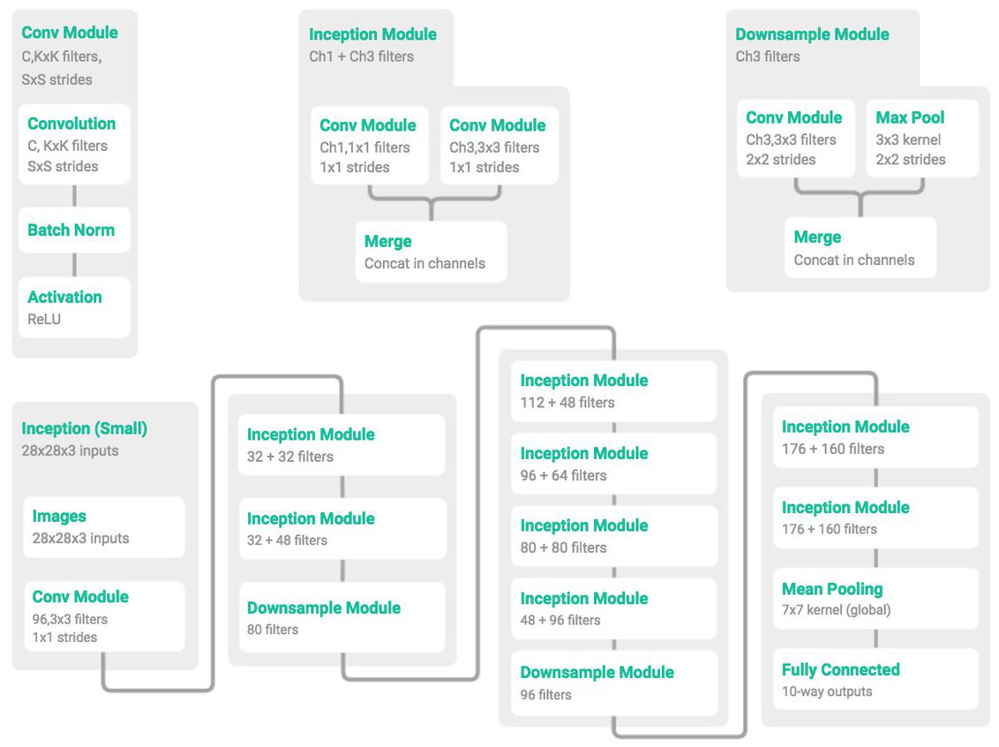
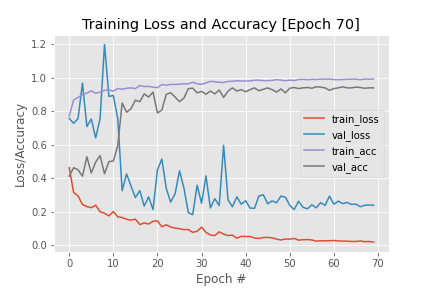
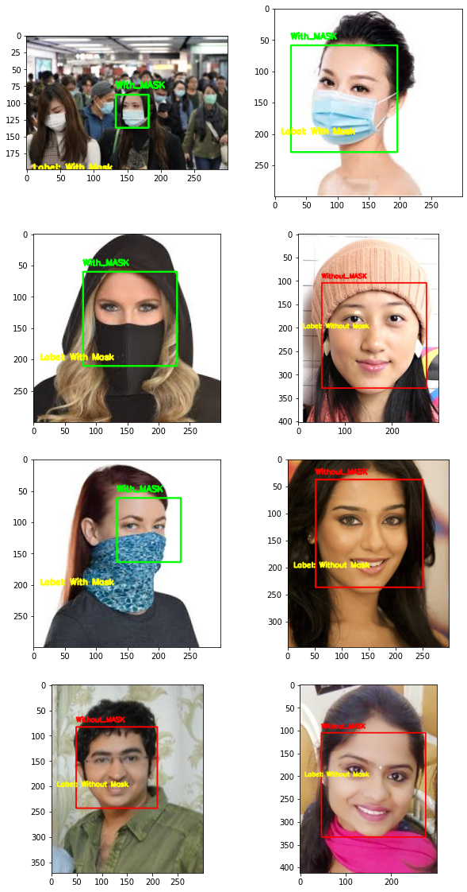

# Mask Detection -  GoogleMiniInception Architecture

## 1) Introduction
For this project, I have used Google MiniInception Architecture provided by Zhang et al.’s 2017 publication, Understanding Deep Learning Requires Re-Thinking Generalization. Below diagram showing the complete Architecture of the model.



## 2) DataSet
for dataset I used few images from github (https://github.com/prajnasb/observations/tree/master/experiements/data) and few images were downloaded using java script(to extract image links from google images) and Python script( to download all images from extracted links). All the required files are located in imageDownload folder.

## 3) DataArgument
As we have less number of images for training. So, we used data argumentation to provide more training and regularization.Data augmentation randomly jitters our training data by applying a series of random translations, rotations, shears, and flips.

## 4) Model Training

4.1) I used GoogleInception model to train model over images using data argumentation and saved model(code in MiniGoogleInception.py).<br>
4.2) Created classification report on train dataset (Code in create_classification_report notebook).<br>
4.3) Used Save model to predict the Unseen images dataset and checked accuracy.<br>


```python
from IPython.display import HTML, display
display(HTML(f"<table><tr><td></td</tr></table>"))
```


<table><tr><td></td</tr></table>


## 5) Classification Report on test dataset


```python
import pandas as pd
pd.read_csv("classification_report_lab.csv")
```


<div>
<style scoped>
    .dataframe tbody tr th:only-of-type {
        vertical-align: middle;
    }

    .dataframe tbody tr th {
        vertical-align: top;
    }

    .dataframe thead th {
        text-align: right;
    }
</style>
<table border="1" class="dataframe">
  <thead>
    <tr style="text-align: right;">
      <th></th>
      <th>Unnamed: 0</th>
      <th>precision</th>
      <th>recall</th>
      <th>f1-score</th>
      <th>support</th>
    </tr>
  </thead>
  <tbody>
    <tr>
      <th>0</th>
      <td>with_mask</td>
      <td>0.989247</td>
      <td>0.992806</td>
      <td>0.991023</td>
      <td>278.000000</td>
    </tr>
    <tr>
      <th>1</th>
      <td>without_mask</td>
      <td>0.989744</td>
      <td>0.984694</td>
      <td>0.987212</td>
      <td>196.000000</td>
    </tr>
    <tr>
      <th>2</th>
      <td>accuracy</td>
      <td>0.989451</td>
      <td>0.989451</td>
      <td>0.989451</td>
      <td>0.989451</td>
    </tr>
    <tr>
      <th>3</th>
      <td>macro avg</td>
      <td>0.989495</td>
      <td>0.988750</td>
      <td>0.989118</td>
      <td>474.000000</td>
    </tr>
    <tr>
      <th>4</th>
      <td>weighted avg</td>
      <td>0.989453</td>
      <td>0.989451</td>
      <td>0.989447</td>
      <td>474.000000</td>
    </tr>
  </tbody>
</table>
</div>


## 6) Few example from Unseen data


```python
%matplotlib inline
import matplotlib.pyplot as plt
import matplotlib.image as mpimg
import os

basePath = "leafsnap-dataset/dataset/images/lab/"
imagePaths = list()

# walk through the directory to get all the images paths
for x in os.walk("PredictedImage"):
    for filename in x[2]:
        filePath = f'{x[0]}/{filename}'
        imagePaths.append(filePath)


fig = plt.figure(figsize=(10,20))
fig.subplots_adjust(hspace=0.2, wspace=0.2)
for index, image in enumerate(imagePaths):
    ax  = fig.add_subplot(4,2 , index+1)
    img = mpimg.imread(image)
    ax.imshow(img)    
```





## 7) WebCam
This python script used to detect mask on live webcam streaming. 


## 8) Future Work
1) Android Mobile Application
2) I will try to work on different optimizer techniques.
3) Try to work on more dense Inception Artictecture to increase accuracy and decrease losses.
